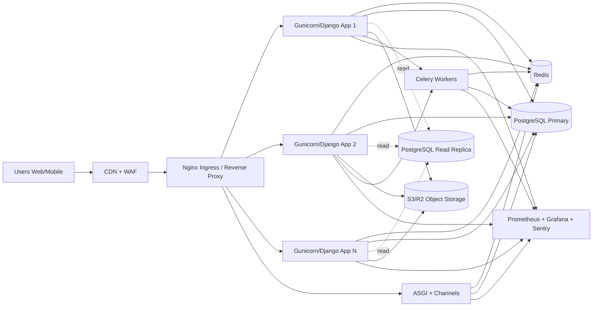

# ITZuun Scalable Infrastructure Diagram (Production)

This document defines the target production architecture for 10k registered users and ~1k concurrent sessions with active bidding, escrow, and chat.

## High-Level Topology

## Request Flow (Read-heavy endpoints)

1. Client request lands on CDN/WAF.
2. Nginx routes traffic to one of Django app instances.
3. App checks Redis cache first (list/detail/summary keys).
4. Cache miss reads from Postgres (prefer read replica for read-only endpoints).
5. Response is cached with TTL + versioned cache key.

## Request Flow (Financial mutation endpoints)

1. Request hits API with `Idempotency-Key`.
2. API validates idempotency record and actor scope.
3. Transaction is executed in Postgres primary with row locks.
4. Immutable financial audit record is written.
5. Related cache keys are invalidated.

## Chat Flow (Realtime)

1. Client opens WebSocket via Nginx to ASGI/Channels.
2. Message is published through Redis pub/sub.
3. Message is persisted to Postgres as storage of record.
4. Subscribers receive pushed message without polling DB.

## Storage & Media

- App stores only object keys/metadata in DB.
- Clients upload via pre-signed URL directly to S3-compatible storage.
- CDN serves static/media for low origin bandwidth and high cache hit.

## Baseline Scale Targets

- 10k+ registered users (DB row scale)
- 1k concurrent sessions (horizontal app scale + Redis cache)
- 100+ active escrow operations (transaction isolation + idempotency)
- Realtime chat traffic handled by Redis transport, not DB polling
